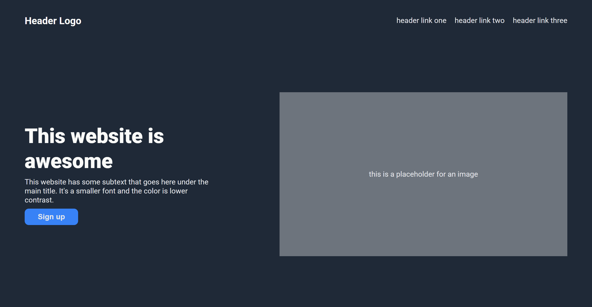

# Landing Page

## Preview



## Description

Simple landing page website.

This project was completed for the **["Landing Page"](https://www.theodinproject.com/lessons/foundations-landing-page)** of the **[Foundations Course](https://www.theodinproject.com/paths/foundations/courses/foundations)** within the **[Foundations](https://www.theodinproject.com/paths/foundations)** path from **[The Odin Project](https://www.theodinproject.com/)**.

## Technologies Used

- HTML5
- CSS3
- Git & GitHub
- Command Line
- Visual Studio Code

## Project Structure

```
odin-landing-page/
├─ README.md
├─ index.html
├─ css/
│  └─ style.css
├─ assets/
│  └─ images/
│     └─ (other images...)
└─ preview.jpg
```

## Installation

1.  **Clone the repository**

    ```sh
    git clone https://github.com/yevgengvr/odin-landing-page.git
    ```

2.  **Navigate to the project directory**
    ```sh
    cd odin-landing-page
    ```

## Usage

Open the `index.html` file in your web browser. You can do this by double-clicking the file in your file explorer or by using your IDE's live server extension.

## Acknowledgments

- [The Odin Project](https://www.theodinproject.com/) curriculum team

## Project Links

**[Live Preview](https://yevgengvr.github.io/odin-landing-page/)** and **[Source](https://github.com/yevgengvr/odin-landing-page)**.
